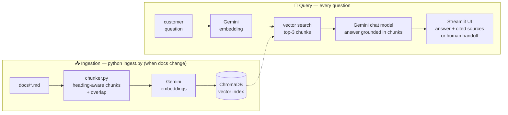

# DocMind 🧠

Chat with your documents. A Retrieval-Augmented Generation (RAG) system built from scratch in Python — no LangChain, no frameworks — to understand every moving part of the pipeline.

**Demo scenario — AI customer support.** The index holds the support knowledge base of *Nimbus*, a fictional smart-thermostat company. The assistant answers customer questions **only** from the company's docs, cites its sources, and hands off to a human agent when the docs don't cover it — the highest-ROI commercial application of RAG (every deflected support ticket saves money). The engine itself is generic: point `docs/` at any folder of files and re-run `ingest.py`.

> 🚧 **Work in progress** — building in public. Follow the commit history to see it grow phase by phase.

## Architecture



## Tech stack

- **Python** — pipeline and glue
- **Gemini API** — answer generation + embeddings
- **ChromaDB** — persistent vector store
- **Streamlit** — chat UI *(coming in Phase 3)*

## Run it yourself

```bash
git clone https://github.com/Sunnylabs-ai/docmind && cd docmind
python3 -m venv .venv && source .venv/bin/activate
pip install -r requirements.txt
cp .env.example .env        # then put your Gemini API key inside
python ingest.py            # index the documents in docs/
python query.py "How many vacation days do I get?"   # CLI
streamlit run app.py                                  # chat UI
```

Drop your own `.md` files into `docs/` and re-run `ingest.py` to chat with anything.

## Project structure

| File | Role |
|---|---|
| `app.py` | Streamlit chat UI — history, spinner, per-answer source chunks |
| `ingest.py` | Load → chunk → embed → store in ChromaDB (run when docs change) |
| `query.py` | Embed question → retrieve top chunks → generate cited answer |
| `chunker.py` | Overlapping, heading-aware chunking strategy |
| `llm.py` | All Gemini calls in one swappable module |
| `rag.py` | The Phase 1 single-file pipeline — kept as the project's origin story |

## Evaluation

RAG systems fail silently — retrieval can rank the wrong chunk first while answers still *look* plausible. So DocMind ships with a test harness (`python eval.py`): questions with known correct sources and facts, including one deliberately unanswerable question that must be refused.

| Metric | Score |
|---|---|
| Retrieval top-1 — right file ranked first | **6/7** |
| Retrieval top-3 — right file in retrieved set | **7/7** |
| Answer accuracy — incl. refusing the unanswerable | **8/8** |

The one top-1 miss is analyzed in *Lessons learned* below — kept visible, not hidden, because the top-3 safety net still produced the correct answer.

## Lessons learned (so far)

- **Chunking quality beats database choice.** In Phase 1, "who founded the company?" retrieved a *menu item* as the top match, because lone paragraphs lack context. Grouping paragraphs under their headings fixed the ranking — before touching any database.
- **Top-k retrieval is a safety net.** Even when the #1 chunk was wrong, the right one was in the top 3, so the answer survived.
- **Grounding works.** Asking for the (nonexistent) wifi password returns "I don't know" instead of a hallucination — enforced by one line in the prompt.
- **Customers don't use your vocabulary.** "How many days do I have to return my *thermostat*?" ranked a troubleshooting chunk (dense with the word "thermostat") a hair above the returns policy — which says "Nimbus *device*" (0.648 vs 0.636 similarity). Top-3 retrieval caught it, but the fix list is real: query expansion, a reranker, or writing docs in the customer's words.
- **Rate limits come in layers.** The eval suite first hit Gemini's 5-requests/*minute* cap, then the 20-requests/*day* cap for `gemini-3.5-flash`. Fixes: exponential-backoff retry in `llm.py`, paced eval runs, and switching to `flash-lite` — quotas are per-model, so model choice is also a quota decision.

## Roadmap

- [x] Phase 0 — Project setup
- [x] Phase 1 — Minimal RAG pipeline in a single script (`rag.py`)
- [x] Phase 2 — Real chunking + persistent vector store (ChromaDB)
- [x] Phase 3 — Streamlit chat UI with source citations
- [x] Phase 4 — Evaluation harness (`eval.py`): retrieval hit-rate + answer accuracy
- [x] Phase 5 — Commercial demo scenario: support knowledge base + human-agent handoff
- [ ] Phase 6 — Architecture diagram, demo GIF, live deployment (Streamlit Community Cloud)
